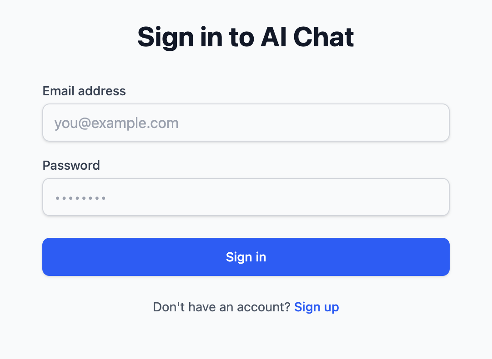
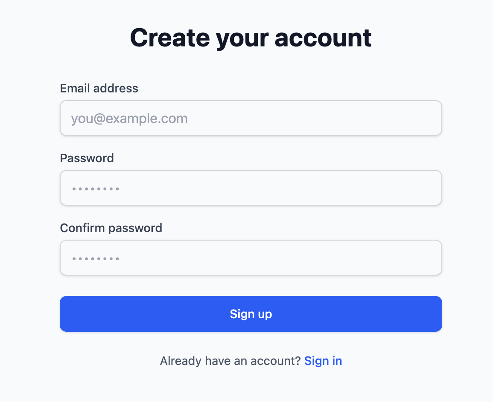
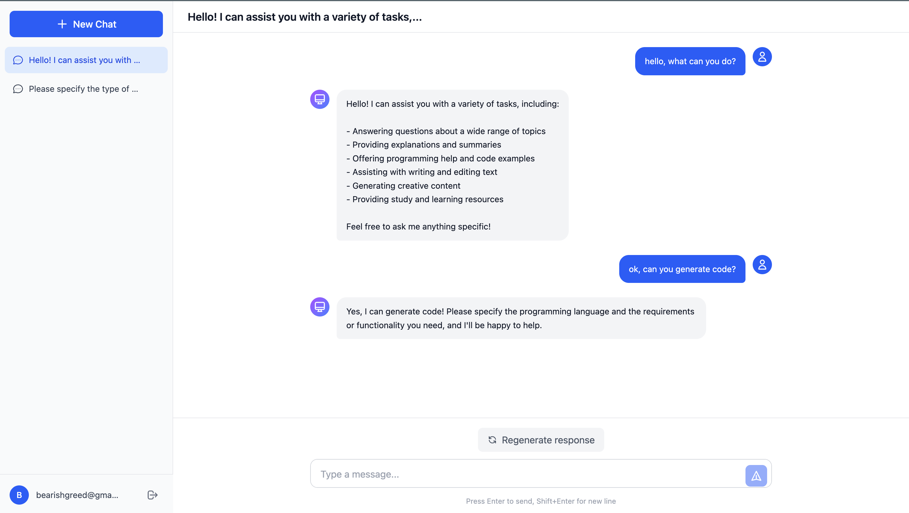
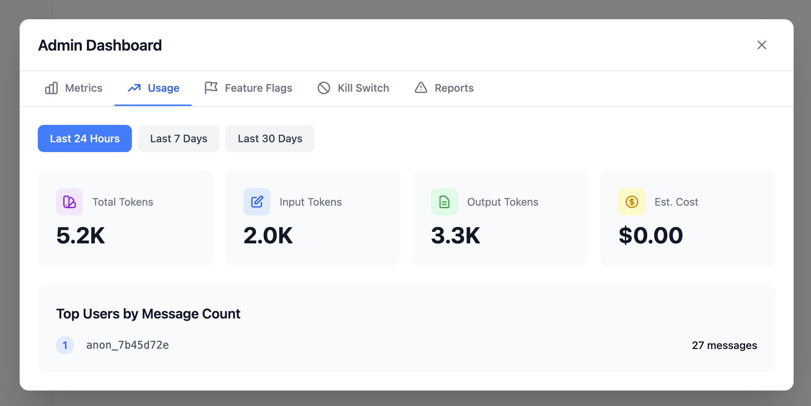
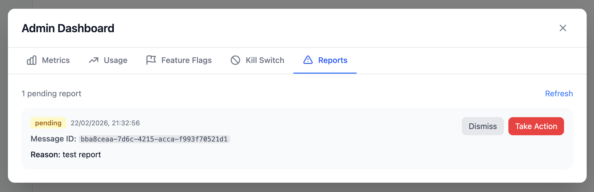
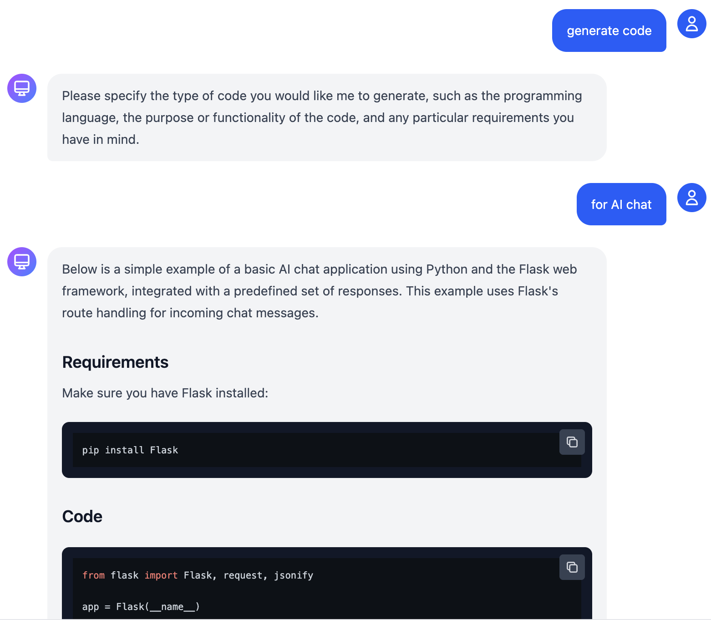

# AI Chat Application

A full-stack AI chat application with real-time streaming responses, conversation history, user authentication, content moderation, and admin dashboard.

## Screenshots

| Login | Registration | Chat |
|-------|--------------|------|
|  |  |  |

| Dashboard | Feedback | Markdown |
|-----------|----------|----------|
|  |  |  |

## Features

- **Real-time AI Chat** - Streaming responses via Server-Sent Events (SSE)
- **User Authentication** - JWT-based login/registration with secure password hashing
- **Conversation Management** - Create, rename, delete, and search conversations
- **Content Moderation** - OpenAI moderation API integration with user reporting
- **Admin Dashboard** - Usage metrics, feature flags, and kill switch controls
- **Rate Limiting** - Per-user request throttling with Redis
- **Modern UI** - React + TailwindCSS with dark mode support

## Tech Stack

| Layer | Technology |
|-------|------------|
| **Frontend** | React, Vite, TypeScript, TailwindCSS |
| **Backend** | Node.js, Express, TypeScript |
| **Database** | PostgreSQL |
| **Cache** | Redis |
| **AI** | OpenAI API (GPT-4) |

## Quick Start

### Prerequisites

- Node.js 20+
- PostgreSQL 15+
- Redis 7+
- OpenAI API key

### Backend Setup

1. **Install dependencies**:
   ```bash
   npm install
   ```

2. **Configure environment**:
   ```bash
   cp .env.example .env
   # Edit .env with your credentials
   ```

3. **Run migrations**:
   ```bash
   npm run migrate
   ```

4. **Start backend server**:
   ```bash
   npm run dev
   ```
   Backend runs on http://localhost:3000

### Frontend Setup

1. **Install dependencies**:
   ```bash
   cd web
   npm install
   ```

2. **Start frontend dev server**:
   ```bash
   npm run dev
   ```
   Frontend runs on http://localhost:5173

## Project Structure

```
├── src/                    # Backend source
│   ├── auth/               # Authentication (JWT, bcrypt)
│   ├── chat/               # Chat service (SSE streaming, LLM)
│   ├── conversations/      # Conversation CRUD
│   ├── moderation/         # Content moderation
│   ├── admin/              # Admin dashboard APIs
│   ├── db/                 # Database (PostgreSQL, Redis)
│   │   └── migrations/     # SQL migrations
│   └── index.ts            # Express app entry
├── web/                    # Frontend source
│   └── src/
│       ├── components/     # React components
│       ├── hooks/          # Custom hooks (useAuth, useChat)
│       └── lib/            # API client
└── docs/                   # Documentation
    └── features/           # Feature specifications
```

## Database Schema

| Table | Description |
|-------|-------------|
| `users` | User accounts with credentials and settings |
| `conversations` | Chat threads owned by users |
| `messages` | Individual messages with role and metadata |
| `reports` | User-submitted content reports |
| `moderation_logs` | Automated moderation event logs |

## Environment Variables

| Variable | Description | Required |
|----------|-------------|----------|
| `DATABASE_URL` | PostgreSQL connection string | Yes |
| `REDIS_URL` | Redis connection string | Yes |
| `JWT_SECRET` | Secret for JWT signing | Yes |
| `OPENAI_API_KEY` | OpenAI API key | Yes |
| `GOOGLE_CLIENT_ID` | Google OAuth client ID | No |
| `VITE_GOOGLE_CLIENT_ID` | Google OAuth client ID (frontend) | No |
| `PORT` | Server port | No (default: 3000) |

## Google OAuth Setup

To enable "Sign in with Google":

1. Go to [Google Cloud Console](https://console.cloud.google.com/)
2. Create a new project or select existing
3. Navigate to **APIs & Services > Credentials**
4. Click **Create Credentials > OAuth client ID**
5. Select **Web application**
6. Add authorized JavaScript origins:
   - `http://localhost:5173` (development)
   - Your production domain
7. Copy the Client ID and add to your `.env`:
   ```
   GOOGLE_CLIENT_ID=your-client-id.apps.googleusercontent.com
   VITE_GOOGLE_CLIENT_ID=your-client-id.apps.googleusercontent.com
   ```
8. Restart both backend and frontend servers

## API Endpoints

| Method | Endpoint | Description |
|--------|----------|-------------|
| `POST` | `/api/auth/register` | Register new user |
| `POST` | `/api/auth/login` | Login and get JWT |
| `POST` | `/api/auth/oauth/google` | Google OAuth login |
| `GET` | `/api/conversations` | List user conversations |
| `POST` | `/api/conversations` | Create conversation |
| `POST` | `/api/conversations/:id/messages` | Send message (SSE stream) |
| `POST` | `/api/conversations/:id/stop` | Stop generation |
| `GET` | `/api/admin/metrics` | Admin metrics |
| `POST` | `/api/moderation/report` | Report message |

## Admin Access

To grant admin access to a user:

1. **Update the user's role in the database**:
   ```sql
   UPDATE users 
   SET settings = jsonb_set(COALESCE(settings, '{}'), '{role}', '"admin"') 
   WHERE email = 'your-email@example.com';
   ```

2. **Log out and log back in** to get a new JWT token with admin privileges.

3. **Access the Admin Dashboard** by clicking the gear icon (⚙️) in the sidebar.

The Admin Dashboard provides:
- **Metrics** - Request volume, latency percentiles, error rates
- **Usage** - Token usage, cost estimates, top users
- **Feature Flags** - Toggle streaming, moderation, rate limiting
- **Kill Switch** - Enable/disable LLM models
- **Reports** - Review and resolve user content reports

## Development

```bash
# Backend
npm run dev          # Start with ts-node
npm run build        # Compile TypeScript
npm test             # Run tests

# Frontend
cd web
npm run dev          # Vite dev server
npm run build        # Production build
```

## Documentation

- [Architecture Design](docs/DESIGN.md)
- [Feature Decomposition](docs/DECOMPOSITION.md)
- [Feature Specifications](docs/features/)
