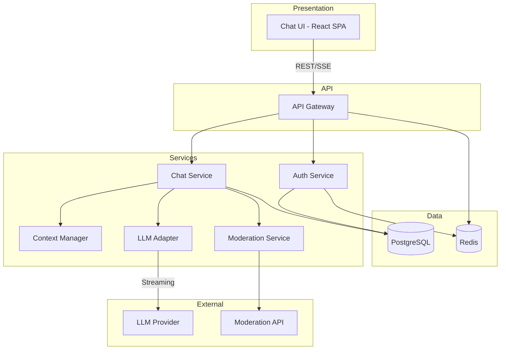
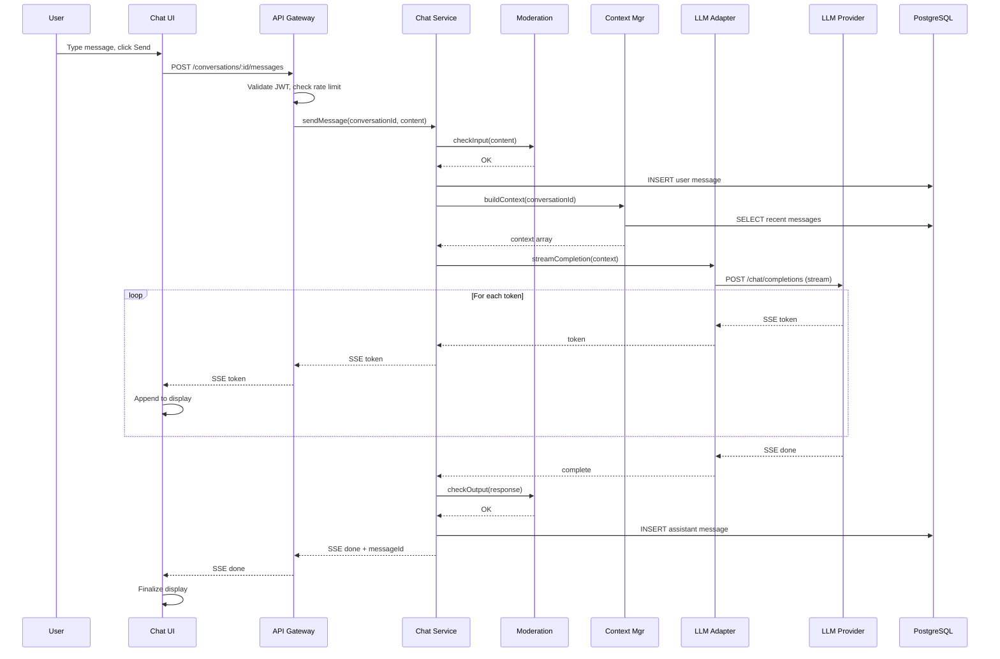
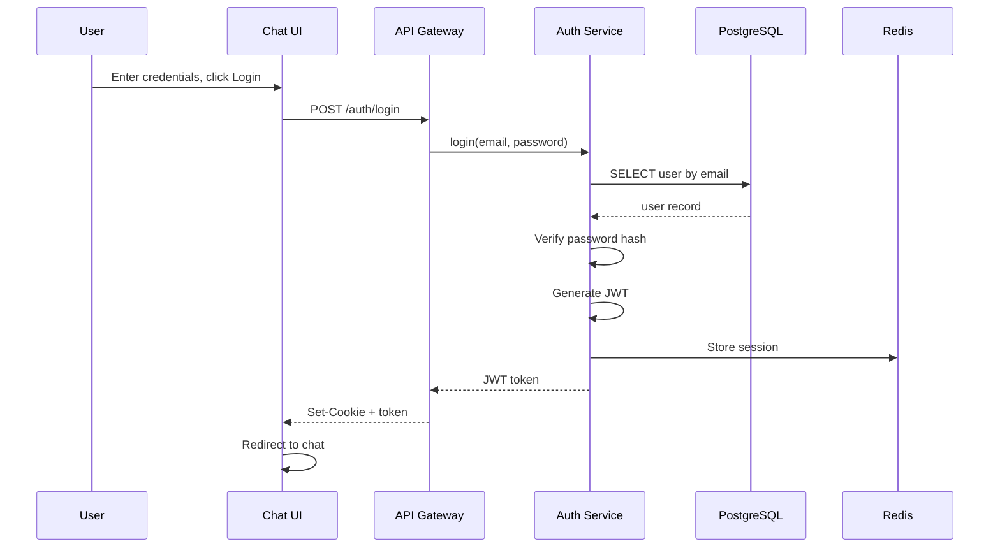

# Technical Design — AI Chat

## 1. Architecture Overview

### 1.1 Architectural Vision

AI Chat employs a modern layered architecture optimized for streaming AI responses and real-time user experience. The system separates concerns across presentation, API, business logic, and data layers, with dedicated integration adapters for external LLM providers and moderation services.

The architecture prioritizes low-latency streaming delivery (TTFT < 2s), horizontal scalability for 500+ concurrent users, and clean separation between stateless API servers and persistent storage. Server-Sent Events (SSE) provide efficient unidirectional streaming from server to client, avoiding WebSocket complexity for the MVP.

Key architectural decisions include stateless API design for horizontal scaling, Redis for session management and rate limiting, PostgreSQL for durable conversation storage, and adapter pattern for LLM provider abstraction.

### 1.2 Architecture Drivers

#### Functional Drivers

| Requirement | Design Response |
|-------------|-----------------|
| `cpt-ai-chat-via-cyber-pilot-fr-streaming` | SSE streaming from API to client; chunked response relay from LLM adapter |
| `cpt-ai-chat-via-cyber-pilot-fr-context-mgmt` | Context service with truncation/summarization strategy; token counting per message |
| `cpt-ai-chat-via-cyber-pilot-fr-rate-limiting` | Redis-backed rate limiter with per-user and per-IP sliding windows |
| `cpt-ai-chat-via-cyber-pilot-fr-moderation` | Moderation service integration for input/output filtering |
| `cpt-ai-chat-via-cyber-pilot-fr-persist-history` | PostgreSQL persistence with conversation/message tables |
| `cpt-ai-chat-via-cyber-pilot-fr-new-chat` | New conversation creation with unique ID; clears current thread |
| `cpt-ai-chat-via-cyber-pilot-fr-send-message` | Message handling with instant UI display; assistant response streaming |
| `cpt-ai-chat-via-cyber-pilot-fr-stop-regen` | Abort controller for stream cancellation; regenerate replaces last turn |
| `cpt-ai-chat-via-cyber-pilot-fr-formatting` | React-Markdown with syntax highlighting; safe HTML rendering |
| `cpt-ai-chat-via-cyber-pilot-fr-sidebar-list` | Conversation list component with auto-title generation |
| `cpt-ai-chat-via-cyber-pilot-fr-rename-delete` | PATCH/DELETE endpoints for conversation management |
| `cpt-ai-chat-via-cyber-pilot-fr-auth` | JWT-based auth with email/password and Google OAuth support |
| `cpt-ai-chat-via-cyber-pilot-fr-llm-routing` | LLM adapter with OpenAI SDK; retry with exponential backoff |
| `cpt-ai-chat-via-cyber-pilot-fr-system-prompt` | Configurable system prompt via environment variable |
| `cpt-ai-chat-via-cyber-pilot-fr-search` | Full-text search on conversation titles and message content via PostgreSQL |
| `cpt-ai-chat-via-cyber-pilot-fr-reporting` | Report button on messages; reports stored in DB and shown in admin console |
| `cpt-ai-chat-via-cyber-pilot-fr-dashboard` | Admin metrics panel with request volume, latency, errors, token usage |
| `cpt-ai-chat-via-cyber-pilot-fr-logs` | Structured logging with request correlation IDs across services |
| `cpt-ai-chat-via-cyber-pilot-fr-incident-controls` | Feature flags and kill switch stored in Redis; admin API for toggling |
| `cpt-ai-chat-via-cyber-pilot-fr-edit-resend` | Message branching support in conversation model (deferred to Phase 2) |
| `cpt-ai-chat-via-cyber-pilot-fr-user-settings` | User settings stored in users table; theme and model preferences |
| `cpt-ai-chat-via-cyber-pilot-fr-privacy` | Account deletion flow; opt-in/out toggle in user settings |

#### NFR Allocation

| NFR ID | NFR Summary | Allocated To | Design Response | Verification Approach |
|--------|-------------|--------------|-----------------|----------------------|
| `cpt-ai-chat-via-cyber-pilot-nfr-performance` | TTFT < 2s, E2E < 8s | LLM Adapter, API Gateway | Streaming relay, connection pooling, async processing | Load testing with P95 metrics |
| `cpt-ai-chat-via-cyber-pilot-nfr-availability` | 99.5% uptime | All components | Health checks, graceful degradation, circuit breakers | Uptime monitoring, synthetic checks |
| `cpt-ai-chat-via-cyber-pilot-nfr-security` | OWASP Top 10 | API Gateway, Auth Service | JWT auth, CSP headers, input validation, TLS | Security audit, penetration testing |
| `cpt-ai-chat-via-cyber-pilot-nfr-scalability` | 500 concurrent users | API Gateway, Chat Service | Stateless design, horizontal scaling, Redis caching | Load testing |

### 1.3 Architecture Layers

```
┌─────────────────────────────────────────────────────────────┐
│                    PRESENTATION LAYER                        │
│  ┌─────────────────────────────────────────────────────┐    │
│  │              React SPA (Chat UI)                     │    │
│  │  - Message rendering, Markdown/code highlighting     │    │
│  │  - SSE client for streaming responses                │    │
│  │  - Conversation sidebar, search                      │    │
│  └─────────────────────────────────────────────────────┘    │
└─────────────────────────────────────────────────────────────┘
                              │
                              ▼ HTTPS / SSE
┌─────────────────────────────────────────────────────────────┐
│                       API LAYER                              │
│  ┌─────────────────────────────────────────────────────┐    │
│  │              API Gateway (Node.js/Express)           │    │
│  │  - REST endpoints, SSE streaming                     │    │
│  │  - Auth middleware (JWT), Rate limiting              │    │
│  │  - Request validation, error handling                │    │
│  └─────────────────────────────────────────────────────┘    │
└─────────────────────────────────────────────────────────────┘
                              │
                              ▼
┌─────────────────────────────────────────────────────────────┐
│                   BUSINESS LOGIC LAYER                       │
│  ┌──────────────┐  ┌──────────────┐  ┌──────────────┐       │
│  │ Chat Service │  │ Auth Service │  │  Moderation  │       │
│  │              │  │              │  │   Service    │       │
│  └──────────────┘  └──────────────┘  └──────────────┘       │
│  ┌──────────────┐  ┌──────────────┐                         │
│  │ Context Mgr  │  │  LLM Adapter │                         │
│  │              │  │              │                         │
│  └──────────────┘  └──────────────┘                         │
└─────────────────────────────────────────────────────────────┘
                              │
                              ▼
┌─────────────────────────────────────────────────────────────┐
│                   DATA / INTEGRATION LAYER                   │
│  ┌──────────────┐  ┌──────────────┐  ┌──────────────┐       │
│  │  PostgreSQL  │  │    Redis     │  │ LLM Provider │       │
│  │ (persistence)│  │(cache/rate)  │  │  (external)  │       │
│  └──────────────┘  └──────────────┘  └──────────────┘       │
└─────────────────────────────────────────────────────────────┘
```

- [x] `p1` - **ID**: `cpt-ai-chat-via-cyber-pilot-tech-layered-architecture`

| Layer | Responsibility | Technology |
|-------|---------------|------------|
| Presentation | Chat UI, message rendering, streaming display | React 18, TypeScript, TailwindCSS |
| API | REST endpoints, SSE streaming, auth, rate limiting | Node.js 20, Express, TypeScript |
| Business Logic | Chat orchestration, context management, moderation | TypeScript services |
| Data Access | Persistence, caching, session management | PostgreSQL 15, Redis 7 |
| Integration | LLM provider communication, external APIs | OpenAI SDK, HTTP clients |

## 2. Principles & Constraints

### 2.1 Design Principles

#### Streaming-First Design

- [x] `p1` - **ID**: `cpt-ai-chat-via-cyber-pilot-principle-streaming-first`

All response delivery paths are designed for streaming from the ground up. The LLM adapter streams tokens as they arrive, the API layer relays chunks via SSE, and the UI renders incrementally. No buffering of complete responses before display.

**Rationale**: Streaming provides immediate feedback, reducing perceived latency from seconds to milliseconds for first token.

#### Stateless API Servers

- [x] `p1` - **ID**: `cpt-ai-chat-via-cyber-pilot-principle-stateless-api`

API servers maintain no local state between requests. All session data lives in Redis, all persistent data in PostgreSQL. Any API instance can handle any request.

**Rationale**: Enables horizontal scaling and zero-downtime deployments. Failed instances can be replaced without session loss.

#### Graceful Degradation

- [x] `p2` - **ID**: `cpt-ai-chat-via-cyber-pilot-principle-graceful-degradation`

When external dependencies fail (LLM provider, moderation service), the system degrades gracefully with clear user feedback rather than hard failures. Circuit breakers prevent cascade failures.

**Rationale**: 99.5% availability requires resilience to partial failures.

### 2.2 Constraints

#### LLM Provider Dependency

- [x] `p1` - **ID**: `cpt-ai-chat-via-cyber-pilot-constraint-llm-dependency`

The system depends on external LLM provider APIs for core functionality. Provider outages directly impact chat capability. Mitigation: circuit breakers, retry with backoff, friendly error messages.

#### Context Window Limits

- [x] `p1` - **ID**: `cpt-ai-chat-via-cyber-pilot-constraint-context-window`

LLM context windows are finite (typically 4K-128K tokens). Long conversations require truncation or summarization strategies. Design must track token counts and apply context management transparently.

#### Rate Limit Budgets

- [x] `p2` - **ID**: `cpt-ai-chat-via-cyber-pilot-constraint-rate-limits`

LLM provider rate limits and cost constraints require per-user quotas. Anonymous users get stricter limits. System must enforce limits without degrading experience for normal usage patterns.

## 3. Technical Architecture

### 3.1 Domain Model

**Technology**: TypeScript interfaces, PostgreSQL tables

**Core Entities**:

| Entity | Description |
|--------|-------------|
| User | Registered account with email, settings, auth credentials |
| Conversation | Thread of messages owned by a user |
| Message | Single turn in conversation (user/assistant/system role) |

**Type Definitions**:

#### User

```typescript
interface User {
  id: string;           // UUID
  email: string;        // Unique, indexed
  passwordHash?: string; // For email/password auth
  oauthProvider?: string; // 'google' | null
  oauthId?: string;     // Provider-specific ID
  settings: UserSettings;
  createdAt: Date;
  updatedAt: Date;
  status: 'active' | 'suspended' | 'deleted';
}

interface UserSettings {
  theme: 'light' | 'dark' | 'system';
  defaultModel?: string;
  improveModelOptIn: boolean;
}
```

#### Conversation

```typescript
interface Conversation {
  id: string;           // UUID
  userId: string;       // FK to User
  title: string;        // Auto-generated or user-set
  createdAt: Date;
  updatedAt: Date;
  deletedAt?: Date;     // Soft delete
  messageCount: number; // Denormalized for performance
}
```

#### Message

```typescript
interface Message {
  id: string;           // UUID
  conversationId: string; // FK to Conversation
  role: 'user' | 'assistant' | 'system';
  content: string;      // Markdown content
  createdAt: Date;
  metadata: MessageMetadata;
}

interface MessageMetadata {
  model?: string;       // Model used for assistant messages
  tokenCount?: number;  // Token count for this message
  latencyMs?: number;   // Response latency
  safetyFlags?: string[]; // Moderation flags if any
  parentMessageId?: string; // For branching/edit scenarios
}
```

**Relationships**:
- User → Conversation: One-to-many (user owns conversations)
- Conversation → Message: One-to-many (conversation contains messages)
- Message → Message: Self-reference for branching (parentMessageId)

**Invariants**:
- Conversation must have userId referencing valid User
- Message role must be one of defined enum values
- Deleted conversations (deletedAt set) excluded from normal queries

### 3.2 Component Model



#### Chat UI

- [x] `p1` - **ID**: `cpt-ai-chat-via-cyber-pilot-component-chat-ui`

##### Why this component exists

Provides the user-facing interface for all chat interactions, handling message display, streaming visualization, and conversation management.

##### Responsibility scope

- Render conversation list in sidebar
- Display message thread with Markdown/code rendering
- Handle SSE streaming and incremental display
- Manage composer input and send actions
- Provide stop/regenerate/edit controls

##### Responsibility boundaries

- Does NOT handle authentication flows (delegates to Auth pages)
- Does NOT directly call LLM providers (goes through API)
- Does NOT persist data locally beyond session cache

##### Related components (by ID)

- `cpt-ai-chat-via-cyber-pilot-component-api-gateway` — calls via REST/SSE

#### API Gateway

- [x] `p1` - **ID**: `cpt-ai-chat-via-cyber-pilot-component-api-gateway`

##### Why this component exists

Single entry point for all client requests. Handles cross-cutting concerns: authentication, rate limiting, request validation, and routing to appropriate services.

##### Responsibility scope

- Expose REST endpoints for conversations, messages, auth
- Establish SSE connections for streaming responses
- Validate JWT tokens and enforce authentication
- Apply rate limiting per user/IP
- Route requests to appropriate services

##### Responsibility boundaries

- Does NOT contain business logic (delegates to services)
- Does NOT directly access database (uses services)
- Does NOT handle LLM communication (delegates to Chat Service)

##### Related components (by ID)

- `cpt-ai-chat-via-cyber-pilot-component-chat-service` — delegates chat operations
- `cpt-ai-chat-via-cyber-pilot-component-auth-service` — delegates auth operations

#### Chat Service

- [x] `p1` - **ID**: `cpt-ai-chat-via-cyber-pilot-component-chat-service`

##### Why this component exists

Core business logic for chat operations. Orchestrates conversation management, message handling, context preparation, and LLM interaction.

##### Responsibility scope

- Create, list, update, delete conversations
- Process incoming messages and prepare context
- Coordinate with LLM Adapter for response generation
- Coordinate with Moderation Service for content filtering
- Persist messages and update conversation state

##### Responsibility boundaries

- Does NOT handle HTTP concerns (API Gateway responsibility)
- Does NOT implement LLM protocol details (LLM Adapter responsibility)
- Does NOT implement auth logic (Auth Service responsibility)

##### Related components (by ID)

- `cpt-ai-chat-via-cyber-pilot-component-context-manager` — depends on for context preparation
- `cpt-ai-chat-via-cyber-pilot-component-llm-adapter` — depends on for LLM communication
- `cpt-ai-chat-via-cyber-pilot-component-moderation-service` — depends on for content filtering

#### Auth Service

- [x] `p1` - **ID**: `cpt-ai-chat-via-cyber-pilot-component-auth-service`

##### Why this component exists

Handles all authentication and session management. Supports email/password and OAuth flows.

##### Responsibility scope

- User registration and login (email/password)
- OAuth flow handling (Google)
- JWT token generation and validation
- Session management via Redis
- Password hashing and verification

##### Responsibility boundaries

- Does NOT handle authorization (role checks in API Gateway)
- Does NOT manage user settings beyond auth-related fields

##### Related components (by ID)

- `cpt-ai-chat-via-cyber-pilot-component-api-gateway` — provides auth middleware

#### Context Manager

- [x] `p1` - **ID**: `cpt-ai-chat-via-cyber-pilot-component-context-manager`

##### Why this component exists

Manages conversation context for LLM requests. Handles token counting, context window limits, and truncation/summarization strategies.

##### Responsibility scope

- Count tokens for messages using tiktoken
- Build context arrays for LLM requests
- Apply truncation when context exceeds limits
- Track token usage per conversation

##### Responsibility boundaries

- Does NOT communicate with LLM (Chat Service orchestrates)
- Does NOT persist data (provides computed context)

##### Related components (by ID)

- `cpt-ai-chat-via-cyber-pilot-component-chat-service` — called by for context preparation

#### LLM Adapter

- [x] `p1` - **ID**: `cpt-ai-chat-via-cyber-pilot-component-llm-adapter`

##### Why this component exists

Abstracts LLM provider communication. Handles streaming protocol, retries, and provider-specific details.

##### Responsibility scope

- Establish streaming connection to LLM provider
- Relay tokens as they arrive
- Handle retries with exponential backoff
- Implement circuit breaker for provider failures
- Abstract provider-specific API differences

##### Responsibility boundaries

- Does NOT decide what to send (receives prepared context)
- Does NOT persist responses (returns stream to caller)

##### Related components (by ID)

- `cpt-ai-chat-via-cyber-pilot-component-chat-service` — called by for LLM requests

#### Moderation Service

- [x] `p2` - **ID**: `cpt-ai-chat-via-cyber-pilot-component-moderation-service`

##### Why this component exists

Filters content for safety policy compliance. Checks both user inputs and assistant outputs.

##### Responsibility scope

- Check user messages before sending to LLM
- Check assistant responses before delivering to user
- Flag or block disallowed content
- Log moderation decisions for review

##### Responsibility boundaries

- Does NOT define policies (configured externally)
- Does NOT handle user reports (separate admin flow)

##### Related components (by ID)

- `cpt-ai-chat-via-cyber-pilot-component-chat-service` — called by for content checks

### 3.3 API Contracts

- [ ] `p1` - **ID**: `cpt-ai-chat-via-cyber-pilot-interface-rest-api`

- **Contracts**: `cpt-ai-chat-via-cyber-pilot-contract-llm`
- **Technology**: REST/JSON + SSE for streaming
- **Base Path**: `/api/v1`

**Authentication Endpoints**:

| Method | Path | Description | Auth |
|--------|------|-------------|------|
| `POST` | `/auth/register` | Register new user | None |
| `POST` | `/auth/login` | Login with email/password | None |
| `POST` | `/auth/oauth/google` | OAuth login with Google | None |
| `POST` | `/auth/logout` | Logout and invalidate session | Required |
| `GET` | `/auth/me` | Get current user | Required |

**Conversation Endpoints**:

| Method | Path | Description | Auth |
|--------|------|-------------|------|
| `GET` | `/conversations` | List user's conversations | Required |
| `POST` | `/conversations` | Create new conversation | Required |
| `GET` | `/conversations/:id` | Get conversation with messages | Required |
| `PATCH` | `/conversations/:id` | Update conversation (rename) | Required |
| `DELETE` | `/conversations/:id` | Delete conversation | Required |
| `GET` | `/conversations/search` | Search conversations | Required |

**Message Endpoints**:

| Method | Path | Description | Auth |
|--------|------|-------------|------|
| `POST` | `/conversations/:id/messages` | Send message, get streaming response | Required |
| `POST` | `/conversations/:id/regenerate` | Regenerate last assistant response | Required |
| `POST` | `/conversations/:id/stop` | Stop current generation | Required |
| `POST` | `/messages/:id/report` | Report problematic message | Required |

**Streaming**: `POST /conversations/:id/messages` returns SSE stream:
```
event: token
data: {"content": "Hello"}

event: token
data: {"content": " world"}

event: done
data: {"messageId": "uuid", "tokenCount": 15}
```

### 3.4 Internal Dependencies

| Dependency Module | Interface Used | Purpose |
|-------------------|----------------|---------|
| Chat Service | TypeScript interface | Conversation and message operations |
| Auth Service | TypeScript interface | Authentication and session management |
| Context Manager | TypeScript interface | Context preparation for LLM |
| LLM Adapter | TypeScript interface | LLM provider communication |
| Moderation Service | TypeScript interface | Content filtering |

**Dependency Rules**:
- API Gateway depends on all services but services don't depend on Gateway
- Chat Service orchestrates other services but they don't depend on it
- No circular dependencies between services

### 3.5 External Dependencies

#### LLM Provider (OpenAI)

| Aspect | Details |
|--------|---------|
| Protocol | HTTPS REST with SSE streaming |
| Authentication | API key in header |
| Endpoints | `/v1/chat/completions` with `stream: true` |
| Rate Limits | Per-organization limits, handled by LLM Adapter |
| Fallback | Circuit breaker, friendly error on failure |

#### Moderation API

| Aspect | Details |
|--------|---------|
| Protocol | HTTPS REST |
| Authentication | API key |
| Endpoints | `/v1/moderations` |
| Fallback | Allow-by-default with logging on API failure |

### 3.6 Interactions & Sequences

#### Send Message Flow

- [x] `p1` - **ID**: `cpt-ai-chat-via-cyber-pilot-seq-send-message`

**Use cases**: `cpt-ai-chat-via-cyber-pilot-usecase-new-chat`, `cpt-ai-chat-via-cyber-pilot-usecase-continue`

**Actors**: `cpt-ai-chat-via-cyber-pilot-actor-user`



**Description**: User sends a message through the UI. The API Gateway validates auth and rate limits, then delegates to Chat Service. Chat Service moderates input, persists the user message, builds context via Context Manager, and initiates streaming via LLM Adapter. Tokens stream back through the chain to the UI. On completion, the assistant message is moderated and persisted.

#### Authentication Flow

- [x] `p1` - **ID**: `cpt-ai-chat-via-cyber-pilot-seq-auth-login`

**Use cases**: `cpt-ai-chat-via-cyber-pilot-usecase-new-chat`

**Actors**: `cpt-ai-chat-via-cyber-pilot-actor-user`, `cpt-ai-chat-via-cyber-pilot-actor-anon`



**Description**: User submits login credentials. Auth Service verifies against stored hash, generates JWT, stores session in Redis, and returns token to client.

### 3.7 Database schemas & tables

#### Table: users

- [x] `p1` - **ID**: `cpt-ai-chat-via-cyber-pilot-dbtable-users`

| Column | Type | Description |
|--------|------|-------------|
| id | uuid | Primary key |
| email | varchar(255) | Unique, indexed |
| password_hash | varchar(255) | Bcrypt hash, nullable for OAuth |
| oauth_provider | varchar(50) | 'google' or null |
| oauth_id | varchar(255) | Provider-specific ID |
| settings | jsonb | User preferences |
| status | varchar(20) | 'active', 'suspended', 'deleted' |
| created_at | timestamptz | Creation timestamp |
| updated_at | timestamptz | Last update timestamp |

**PK**: `id`

**Constraints**: `UNIQUE(email)`, `CHECK(status IN ('active', 'suspended', 'deleted'))`

**Indexes**: `idx_users_email` on `email`

#### Table: conversations

- [x] `p1` - **ID**: `cpt-ai-chat-via-cyber-pilot-dbtable-conversations`

| Column | Type | Description |
|--------|------|-------------|
| id | uuid | Primary key |
| user_id | uuid | FK to users.id |
| title | varchar(255) | Conversation title |
| message_count | integer | Denormalized count |
| created_at | timestamptz | Creation timestamp |
| updated_at | timestamptz | Last update timestamp |
| deleted_at | timestamptz | Soft delete timestamp |

**PK**: `id`

**Constraints**: `user_id REFERENCES users(id) ON DELETE CASCADE`

**Indexes**: `idx_conversations_user_id` on `user_id`, `idx_conversations_updated_at` on `updated_at DESC`

#### Table: messages

- [x] `p1` - **ID**: `cpt-ai-chat-via-cyber-pilot-dbtable-messages`

| Column | Type | Description |
|--------|------|-------------|
| id | uuid | Primary key |
| conversation_id | uuid | FK to conversations.id |
| role | varchar(20) | 'user', 'assistant', 'system' |
| content | text | Message content (Markdown) |
| metadata | jsonb | Model, tokens, latency, flags |
| parent_message_id | uuid | For branching, nullable |
| created_at | timestamptz | Creation timestamp |

**PK**: `id`

**Constraints**: `conversation_id REFERENCES conversations(id) ON DELETE CASCADE`, `CHECK(role IN ('user', 'assistant', 'system'))`

**Indexes**: `idx_messages_conversation_id` on `conversation_id`, `idx_messages_created_at` on `created_at`

**Example**:

| id | conversation_id | role | content |
|----|-----------------|------|---------|
| 550e8400... | 7c9e6679... | user | How do I sort an array in Python? |
| 6ba7b810... | 7c9e6679... | assistant | You can sort an array using... |

## 4. Additional Context

### Technology Stack Summary

| Layer | Technology | Rationale |
|-------|------------|-----------|
| Frontend | React 18, TypeScript, TailwindCSS | Modern, type-safe, rapid UI development |
| API | Node.js 20, Express, TypeScript | JavaScript ecosystem, good streaming support |
| Database | PostgreSQL 15 | ACID, JSONB support, mature ecosystem |
| Cache | Redis 7 | Fast sessions, rate limiting, pub/sub ready |
| LLM | OpenAI API | Leading models, good streaming support |

### Future Considerations

- **Phase 2**: File attachments will require object storage (S3/GCS) and text extraction pipeline
- **Phase 2**: Conversation sharing will need public URL generation and access control
- **Phase 3**: Tool calling will require sandboxed execution environment

### Trade-offs Accepted

- **SSE over WebSocket**: Simpler implementation, sufficient for unidirectional streaming. WebSocket may be needed for Phase 3 bidirectional tool interactions.
- **PostgreSQL over NoSQL**: Relational model fits conversation/message structure well. May need read replicas for scale.
- **Single LLM provider**: MVP simplicity. Adapter pattern allows adding providers later.

## 5. Traceability

- **PRD**: [PRD.md](./PRD.md)
- **ADRs**: [ADR/](./ADR/) (to be created)
- **Features**: [features/](./features/) (to be created via DECOMPOSITION)
